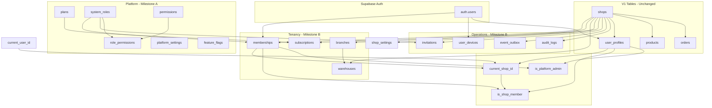

# Dependency Graph — RetailX POS V2 (Milestone B)



## Migration Dependency Order

```
20260707100000 extensions_and_enums
    └── 20260707100001 platform_foundation (plans, roles, flags)
        └── 20260707100002 private_helpers_stub
            └── 20260707110000 milestone_b_enums
                └── 20260707110001 tenancy_tables (requires shops)
                    └── 20260707110002 operational_tables
                        └── 20260707110003 infrastructure_triggers
                            └── 20260707110004 private_helpers
                                └── 20260707110005 milestone_b_indexes
                                    └── 20260707110006 compatibility_views
                                        └── 20260707110007 rls_skeleton
```

## External Dependencies

| Dependency | Required for | Notes |
|------------|--------------|-------|
| `public.shops` (V1) | tenancy_tables FK | Exists in production; bootstrap for CI |
| `auth.users` (Supabase) | memberships, user_devices FK | Conditional FK — skipped on plain Postgres |
| `gen_random_uuid()` | All UUID PKs | Requires pgcrypto extension (Milestone A) |

## Rollback Order (reverse)

```
rls_skeleton → compatibility_views → indexes → private_helpers
→ triggers → operational_tables → tenancy_tables → milestone_b_enums
```

Rollback does **not** drop V1 tables or Milestone A platform tables.
