# ER Diagram — RetailX POS V2 (Milestone B)

```mermaid
erDiagram
  auth_users ||--o{ memberships : has
  auth_users ||--o{ user_devices : registers
  auth_users ||--o| user_profiles : "V1 compat"

  shops ||--o{ memberships : has
  shops ||--o{ branches : has
  shops ||--o{ warehouses : has
  shops ||--o{ shop_settings : has
  shops ||--o| subscriptions : has
  shops ||--o{ invitations : has
  shops ||--o{ event_outbox : emits
  shops ||--o{ audit_logs : logs

  shops ||--o{ user_profiles : "V1 compat"
  shops ||--o{ products : "V1 business"
  shops ||--o{ orders : "V1 business"

  branches ||--o{ warehouses : optional

  system_roles ||--o{ memberships : assigns
  system_roles ||--o{ invitations : invites
  system_roles ||--o{ role_permissions : has

  permissions ||--o{ role_permissions : grants
  plans ||--o{ subscriptions : bills

  memberships {
    uuid id PK
    uuid user_id FK
    uuid shop_id FK
    uuid role_id FK
    membership_status status
    boolean is_primary
    timestamptz deleted_at
  }

  branches {
    uuid id PK
    uuid shop_id FK
    text name
    branch_status status
    boolean is_default
    timestamptz deleted_at
  }

  warehouses {
    uuid id PK
    uuid shop_id FK
    uuid branch_id FK
    text name
    warehouse_status status
    boolean is_default
    timestamptz deleted_at
  }

  shop_settings {
    uuid id PK
    uuid shop_id FK
    text key
    jsonb value
  }

  subscriptions {
    uuid id PK
    uuid shop_id FK
    uuid plan_id FK
    subscription_status status
  }

  invitations {
    uuid id PK
    uuid shop_id FK
    text email
    uuid role_id FK
    invitation_status status
  }

  user_devices {
    uuid id PK
    uuid user_id FK
    uuid shop_id FK
    text device_fingerprint
    device_platform platform
  }

  event_outbox {
    uuid id PK
    uuid shop_id FK
    text event_type
    outbox_status status
    jsonb payload
  }

  audit_logs {
    uuid id PK
    uuid shop_id FK
    uuid user_id
    audit_action action
    text entity_type
    text entity_id
  }

  plans {
    uuid id PK
    text code UK
    text name
  }

  system_roles {
    uuid id PK
    text slug UK
    role_scope scope
  }

  feature_flags {
    text key PK
    boolean enabled
    jsonb environments
  }

  platform_settings {
    text key PK
    jsonb value
    text category
  }
```

## Legend

- **Solid lines**: Milestone B V2 relationships
- **V1 business tables** (products, orders, etc.) shown for context only — unchanged
- `auth_users` = Supabase `auth.users` (FK conditional on Supabase)
